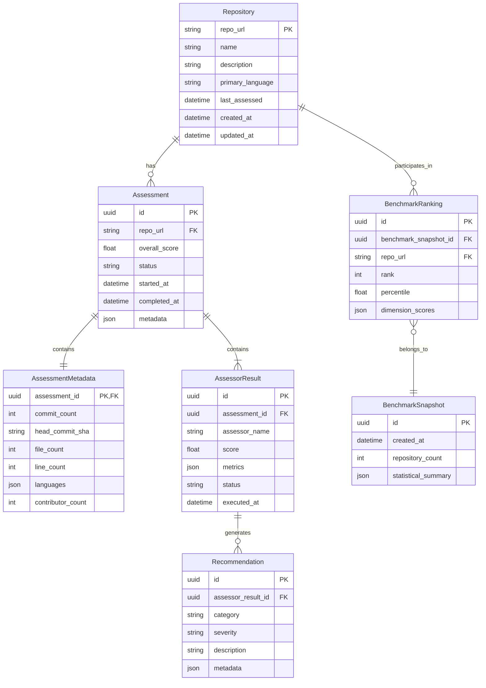

# Data Model: Quality Profiling and Benchmarking with UI

**Feature**: 003-quality-profiling-ui | **Date**: 2026-01-28 | **Phase**: 1

This document defines the core entities, their relationships, validation rules, and state transitions for the quality profiling feature.

## Entity Relationship Diagram



## Entity Definitions

### 1. Repository

Represents a code repository that can be assessed by ship-shape.

**Fields**:
- `repo_url` (string, primary key): Unique identifier for the repository (Git URL or GitHub/GitLab URL)
- `name` (string, required): Repository name extracted from URL or manifest
- `description` (string, optional): Repository description from README or manifest
- `primary_language` (string, optional): Detected primary programming language
- `last_assessed` (datetime, optional): Timestamp of most recent assessment
- `created_at` (datetime, required): When repository was first added to system
- `updated_at` (datetime, required): When repository record was last modified

**Validation Rules**:
- `repo_url` must be valid Git URL format (https://, git://, or git@)
- `repo_url` must be unique across all repositories
- `name` max length: 255 characters
- `description` max length: 1000 characters
- `primary_language` must match supported languages list (Python, JavaScript, TypeScript, Java, Go, Rust, etc.)
- `last_assessed` cannot be in the future
- `updated_at` >= `created_at`

**State Transitions**:
1. **Created**: Repository record created when first assessment is requested
2. **Assessed**: Repository has at least one completed assessment
3. **Stale**: Repository not assessed in >90 days (warning state)

**Indexes**:
- Primary: `repo_url`
- Secondary: `name`, `last_assessed` (for stale repository queries)

---

### 2. Assessment

Represents a single quality assessment run for a repository.

**Fields**:
- `id` (uuid, primary key): Unique assessment identifier
- `repo_url` (string, foreign key): References Repository.repo_url
- `overall_score` (float, required): Weighted average of all assessor scores (0.0-100.0)
- `status` (string, required): Current assessment status (pending, running, completed, failed, cancelled)
- `started_at` (datetime, required): When assessment began
- `completed_at` (datetime, optional): When assessment finished (null if running/pending)
- `metadata` (json, optional): Assessment execution metadata (duration, resource usage, errors)

**Validation Rules**:
- `overall_score` must be in range [0.0, 100.0]
- `status` must be one of: pending, running, completed, failed, cancelled
- `completed_at` must be >= `started_at` if present
- `completed_at` required if status is completed or failed
- Assessment can have multiple assessor results (1-N relationship)

**State Transitions**:
```
pending → running → completed
               ↓
             failed
               ↓
           cancelled
```

**State Transition Rules**:
- **pending → running**: Assessment execution begins
- **running → completed**: All assessors succeeded, overall_score calculated
- **running → failed**: One or more critical assessors failed
- **pending/running → cancelled**: User cancels assessment

**Indexes**:
- Primary: `id`
- Foreign: `repo_url`
- Composite: (`repo_url`, `started_at`) for historical queries

---

### 3. AssessmentMetadata

Contains repository metadata captured during assessment.

**Fields**:
- `assessment_id` (uuid, primary & foreign key): References Assessment.id
- `commit_count` (int, optional): Total commits in repository history
- `head_commit_sha` (string, required): Git SHA of assessed commit
- `file_count` (int, required): Total files in repository
- `line_count` (int, required): Total lines of code
- `languages` (json, required): Language breakdown `{"Python": 5000, "JavaScript": 2000}`
- `contributor_count` (int, optional): Number of unique contributors

**Validation Rules**:
- `commit_count` >= 0
- `head_commit_sha` must be valid Git SHA (40 hex characters)
- `file_count` >= 0
- `line_count` >= 0
- `languages` must be dict of language:line_count pairs
- `contributor_count` >= 0

**Relationships**:
- One-to-one with Assessment

---

### 4. AssessorResult

Stores the result of a single assessor's execution within an assessment.

**Fields**:
- `id` (uuid, primary key): Unique assessor result identifier
- `assessment_id` (uuid, foreign key): References Assessment.id
- `assessor_name` (string, required): Name of the assessor (test_coverage, integration_tests, etc.)
- `score` (float, required): Assessor score (0.0-100.0)
- `metrics` (json, required): Assessor-specific metrics (varies by assessor)
- `status` (string, required): Execution status (success, failed, skipped)
- `executed_at` (datetime, required): When assessor ran

**Validation Rules**:
- `assessor_name` must match registered assessor names
- `score` must be in range [0.0, 100.0]
- `status` must be one of: success, failed, skipped
- `metrics` must conform to assessor-specific schema (validated per assessor)
- Multiple assessor results per assessment allowed (one per assessor)

**Assessor-Specific Metric Schemas**:

**test_coverage**:
```json
{
  "line_coverage": 87.5,
  "branch_coverage": 82.3,
  "function_coverage": 90.1,
  "test_to_code_ratio": 0.65,
  "test_count": 342,
  "test_execution_time_seconds": 45.2
}
```

**integration_tests**:
```json
{
  "integration_test_count": 45,
  "api_endpoint_coverage": 75.0,
  "database_test_coverage": 60.0,
  "external_service_mocking": true,
  "contract_testing_present": false
}
```

**documentation_standards**:
```json
{
  "readme_score": 80,
  "api_documentation_completeness": 70,
  "architecture_docs_present": true,
  "docstring_coverage": 65.0,
  "comment_quality_score": 75,
  "documentation_freshness_days": 30
}
```

**ecosystem_tools**:
```json
{
  "ci_cd": {
    "present": true,
    "platform": "github_actions",
    "test_execution": true,
    "coverage_reporting": true,
    "quality_score": 85
  },
  "code_coverage_tracking": {
    "present": true,
    "tool": "codecov",
    "configured_properly": true
  },
  "security_scanning": {
    "present": true,
    "tools": ["dependabot", "snyk"],
    "auto_fix_enabled": true
  },
  "e2e_testing": {
    "present": true,
    "tool": "playwright",
    "coverage": 60.0
  }
}
```

**Indexes**:
- Primary: `id`
- Foreign: `assessment_id`
- Composite: (`assessment_id`, `assessor_name`) for assessor-specific queries

---

### 5. Recommendation

Represents an actionable recommendation generated by an assessor.

**Fields**:
- `id` (uuid, primary key): Unique recommendation identifier
- `assessor_result_id` (uuid, foreign key): References AssessorResult.id
- `category` (string, required): Recommendation category (testing, documentation, security, etc.)
- `severity` (string, required): Recommendation priority (critical, high, medium, low)
- `description` (string, required): Human-readable recommendation text
- `metadata` (json, optional): Additional context (file paths, line numbers, suggested fixes)

**Validation Rules**:
- `category` must be one of: testing, documentation, security, code_quality, ecosystem, maintainability
- `severity` must be one of: critical, high, medium, low
- `description` max length: 1000 characters
- `metadata` may contain: affected_files (array), suggested_tools (array), external_links (array)

**Example**:
```json
{
  "category": "testing",
  "severity": "high",
  "description": "Increase branch coverage to >80% for critical paths in auth module",
  "metadata": {
    "affected_files": ["src/auth/login.py", "src/auth/session.py"],
    "current_coverage": 65.0,
    "target_coverage": 80.0,
    "suggested_tools": ["pytest-cov", "coverage.py"]
  }
}
```

**Indexes**:
- Primary: `id`
- Foreign: `assessor_result_id`
- Secondary: `severity` (for filtering high-priority recommendations)

---

### 6. BenchmarkSnapshot

Represents a point-in-time benchmark calculation across all repositories.

**Fields**:
- `id` (uuid, primary key): Unique benchmark snapshot identifier
- `created_at` (datetime, required): When benchmark was calculated
- `repository_count` (int, required): Number of repositories included in benchmark
- `statistical_summary` (json, required): Aggregate statistics for the benchmark

**Validation Rules**:
- `repository_count` > 0
- `statistical_summary` must contain: mean, median, std_dev, min, max for overall_score and each assessor

**Statistical Summary Schema**:
```json
{
  "overall_score": {
    "mean": 75.2,
    "median": 78.0,
    "std_dev": 12.3,
    "min": 35.0,
    "max": 98.5,
    "percentiles": {
      "p25": 65.0,
      "p50": 78.0,
      "p75": 85.0,
      "p90": 92.0,
      "p95": 95.0
    }
  },
  "test_coverage": { /* same structure */ },
  "integration_tests": { /* same structure */ },
  /* ... other assessors ... */
}
```

**Indexes**:
- Primary: `id`
- Secondary: `created_at` (for historical benchmark queries)

---

### 7. BenchmarkRanking

Represents a single repository's ranking within a benchmark snapshot.

**Fields**:
- `id` (uuid, primary key): Unique ranking identifier
- `benchmark_snapshot_id` (uuid, foreign key): References BenchmarkSnapshot.id
- `repo_url` (string, foreign key): References Repository.repo_url
- `rank` (int, required): Repository's rank (1 = highest score)
- `percentile` (float, required): Repository's percentile (0.0-100.0, higher is better)
- `dimension_scores` (json, required): Per-assessor scores and ranks

**Validation Rules**:
- `rank` > 0
- `percentile` in range [0.0, 100.0]
- `dimension_scores` must contain scores and ranks for all assessors

**Dimension Scores Schema**:
```json
{
  "test_coverage": {
    "score": 87.5,
    "rank": 12,
    "percentile": 85.0
  },
  "integration_tests": {
    "score": 70.0,
    "rank": 45,
    "percentile": 60.0
  },
  /* ... other assessors ... */
}
```

**Indexes**:
- Primary: `id`
- Foreign: `benchmark_snapshot_id`, `repo_url`
- Composite: (`benchmark_snapshot_id`, `rank`) for rank-ordered queries

---

## Data Flow Patterns

### Assessment Flow

```
1. User triggers assessment via CLI or UI
   ↓
2. Create Repository record (if new) or update last_assessed
   ↓
3. Create Assessment with status=pending
   ↓
4. Update Assessment status=running
   ↓
5. For each assessor:
   - Execute assessor logic
   - Create AssessorResult
   - Generate Recommendations
   ↓
6. Calculate overall_score (weighted average)
   ↓
7. Update Assessment status=completed, completed_at=now
   ↓
8. Trigger benchmark recalculation (if configured)
```

### Benchmarking Flow

```
1. Fetch all completed Assessments (most recent per repository)
   ↓
2. Calculate statistical summary (mean, median, std_dev, percentiles)
   ↓
3. Create BenchmarkSnapshot with statistical_summary
   ↓
4. For each repository:
   - Calculate rank (1 = highest score)
   - Calculate percentile
   - Calculate per-assessor ranks
   - Create BenchmarkRanking
   ↓
5. Return BenchmarkSnapshot.id for querying
```

### UI Data Retrieval Flow

```
1. Dashboard loads: Fetch all Repositories with last_assessed
   ↓
2. For each repository, fetch latest Assessment
   ↓
3. Display in table: repo_name, overall_score, last_assessed
   ↓
4. User clicks repository: Fetch Assessment with AssessorResults
   ↓
5. Display radar chart: Map AssessorResult.score to radar dimensions
   ↓
6. Display recommendations: Fetch Recommendations grouped by severity
```

---

## Storage Implementation

### SQLite Schema (MVP)

```sql
CREATE TABLE repositories (
    repo_url TEXT PRIMARY KEY,
    name TEXT NOT NULL,
    description TEXT,
    primary_language TEXT,
    last_assessed DATETIME,
    created_at DATETIME NOT NULL DEFAULT CURRENT_TIMESTAMP,
    updated_at DATETIME NOT NULL DEFAULT CURRENT_TIMESTAMP
);

CREATE TABLE assessments (
    id TEXT PRIMARY KEY,  -- UUID as text
    repo_url TEXT NOT NULL,
    overall_score REAL NOT NULL CHECK (overall_score >= 0 AND overall_score <= 100),
    status TEXT NOT NULL CHECK (status IN ('pending', 'running', 'completed', 'failed', 'cancelled')),
    started_at DATETIME NOT NULL DEFAULT CURRENT_TIMESTAMP,
    completed_at DATETIME,
    metadata TEXT,  -- JSON
    FOREIGN KEY (repo_url) REFERENCES repositories(repo_url) ON DELETE CASCADE
);

CREATE TABLE assessment_metadata (
    assessment_id TEXT PRIMARY KEY,
    commit_count INTEGER,
    head_commit_sha TEXT NOT NULL,
    file_count INTEGER NOT NULL CHECK (file_count >= 0),
    line_count INTEGER NOT NULL CHECK (line_count >= 0),
    languages TEXT NOT NULL,  -- JSON
    contributor_count INTEGER,
    FOREIGN KEY (assessment_id) REFERENCES assessments(id) ON DELETE CASCADE
);

CREATE TABLE assessor_results (
    id TEXT PRIMARY KEY,  -- UUID as text
    assessment_id TEXT NOT NULL,
    assessor_name TEXT NOT NULL,
    score REAL NOT NULL CHECK (score >= 0 AND score <= 100),
    metrics TEXT NOT NULL,  -- JSON
    status TEXT NOT NULL CHECK (status IN ('success', 'failed', 'skipped')),
    executed_at DATETIME NOT NULL DEFAULT CURRENT_TIMESTAMP,
    FOREIGN KEY (assessment_id) REFERENCES assessments(id) ON DELETE CASCADE,
    UNIQUE (assessment_id, assessor_name)
);

CREATE TABLE recommendations (
    id TEXT PRIMARY KEY,  -- UUID as text
    assessor_result_id TEXT NOT NULL,
    category TEXT NOT NULL CHECK (category IN ('testing', 'documentation', 'security', 'code_quality', 'ecosystem', 'maintainability')),
    severity TEXT NOT NULL CHECK (severity IN ('critical', 'high', 'medium', 'low')),
    description TEXT NOT NULL,
    metadata TEXT,  -- JSON
    FOREIGN KEY (assessor_result_id) REFERENCES assessor_results(id) ON DELETE CASCADE
);

CREATE TABLE benchmark_snapshots (
    id TEXT PRIMARY KEY,  -- UUID as text
    created_at DATETIME NOT NULL DEFAULT CURRENT_TIMESTAMP,
    repository_count INTEGER NOT NULL CHECK (repository_count > 0),
    statistical_summary TEXT NOT NULL  -- JSON
);

CREATE TABLE benchmark_rankings (
    id TEXT PRIMARY KEY,  -- UUID as text
    benchmark_snapshot_id TEXT NOT NULL,
    repo_url TEXT NOT NULL,
    rank INTEGER NOT NULL CHECK (rank > 0),
    percentile REAL NOT NULL CHECK (percentile >= 0 AND percentile <= 100),
    dimension_scores TEXT NOT NULL,  -- JSON
    FOREIGN KEY (benchmark_snapshot_id) REFERENCES benchmark_snapshots(id) ON DELETE CASCADE,
    FOREIGN KEY (repo_url) REFERENCES repositories(repo_url) ON DELETE CASCADE
);

-- Indexes
CREATE INDEX idx_assessments_repo_url ON assessments(repo_url);
CREATE INDEX idx_assessments_repo_started ON assessments(repo_url, started_at DESC);
CREATE INDEX idx_assessor_results_assessment ON assessor_results(assessment_id);
CREATE INDEX idx_recommendations_assessor_result ON recommendations(assessor_result_id);
CREATE INDEX idx_recommendations_severity ON recommendations(severity);
CREATE INDEX idx_benchmark_rankings_snapshot ON benchmark_rankings(benchmark_snapshot_id, rank);
CREATE INDEX idx_repositories_last_assessed ON repositories(last_assessed);
```

### PostgreSQL Migration (Future)

When scaling beyond 10k repositories:
- Change TEXT PRIMARY KEY to UUID type
- Add partitioning for assessments by repo_url (for large-scale historical data)
- Add materialized views for benchmark calculations
- Add full-text search indexes for recommendations.description

---

## Validation Summary

All entities follow Constitution principles:
- **Measurable**: All scores are 0-100, all metrics are quantifiable
- **Evidence-Based**: Entities map to research.md framework analysis
- **Tool-First**: Models support both CLI (direct DB access) and API (REST endpoints)
- **Structured Output**: JSON fields support machine-readable data, text fields for humans

**Next Steps**: Define API contracts in `/contracts/` directory
